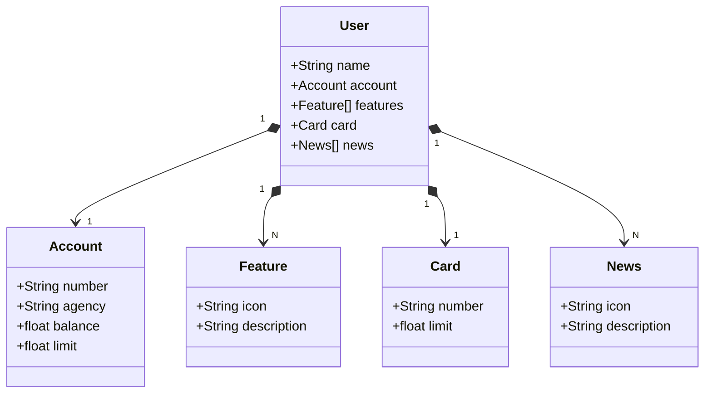

# Java RESTful API para backend de banco

## Diagrama de Classes

```mermaid
classDiagram
    class User {
        +String name
        +Account account
        +Feature[] features
        +Card card
        +News[] news
    }

    %% Detalhe da classe Account
    class Account {
        +String number
        +String agency
        +float balance
        +float limit
    }

    %% Detalhe da classe Feature
    class Feature {
        +String icon
        +String description
    }

    %% Detalhe da classe Card
    class Card {
        +String number
        +float limit
    }

    %% Detalhe da classe News
    class News {
        +String icon
        +String description
    }

    %% Relacionamentos detalhados sem nomes nas setas
    User "1" *--> "1" Account 
    User "1" *--> "N"Feature 
    User "1" *--> "1" Card 
    User "1" *--> "N" News 

```
